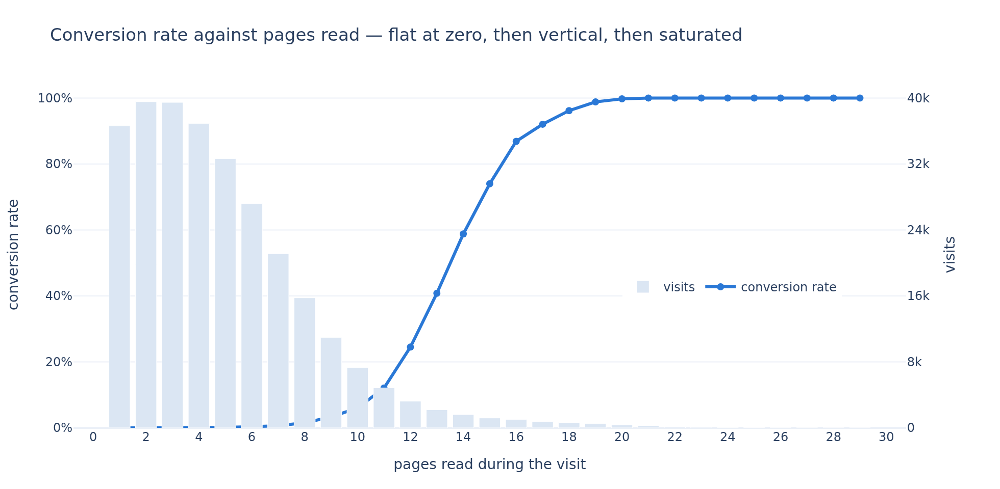
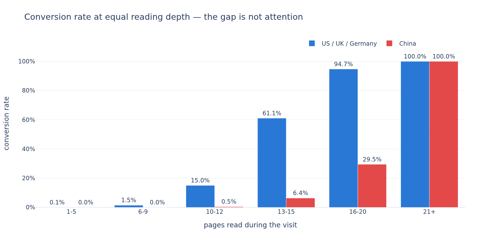
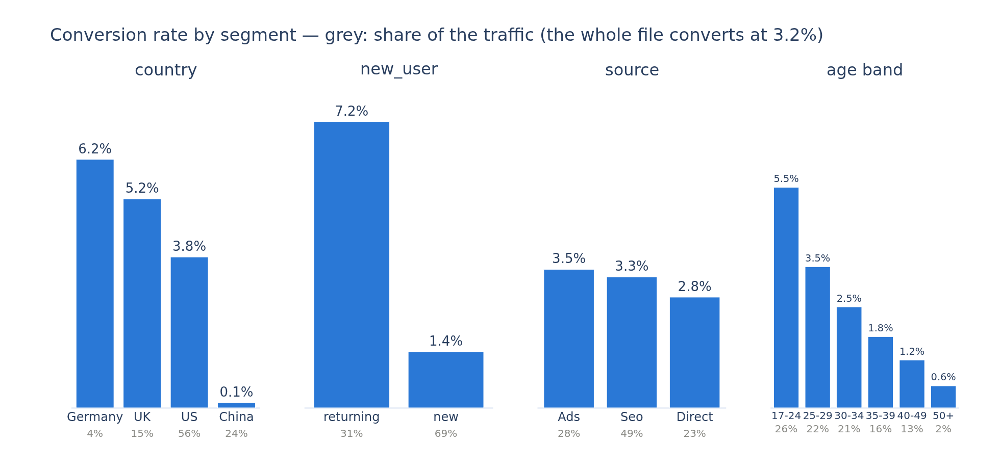
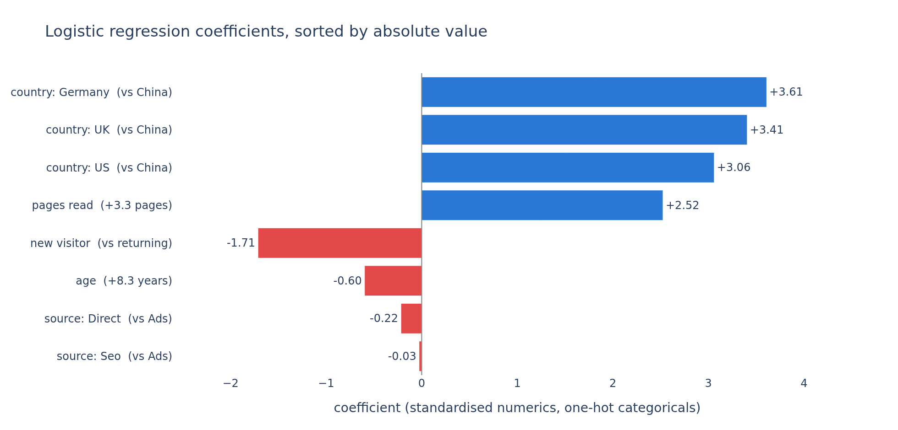

# Who subscribes to the newsletter — and what can be done about it?

A conversion model built for **www.datascienceweekly.org**, who wanted to read its parameters and
find a lever on a **3.2%** conversion rate.

Jedha *Full Stack Data Scientist* — **Block 3, Machine Learning Project** (Conversion rate
challenge). scikit-learn.

The full analysis, with every decision and its measured cost, is in
[`conversion_rate_project.ipynb`](conversion_rate_project.ipynb).

## The problem

The newsletter's data scientists opened a competition: predict, from five columns about a visit,
whether the visitor subscribes. The score is the **f1-score of the positive class** — 3.2% of
visits convert, so accuracy is meaningless (predicting "nobody subscribes" is right 96.8% of the
time). Part of the brief is the model itself; the other part is reading its parameters for
something the team can act on.

The model was built as asked. It reaches **f1 = 0.77 on unseen visitors**, and the answer to the
question behind the brief is uncomfortable:

> The score is almost entirely carried by **how many pages the visitor read** — a behaviour that
> happens during the visit, which the team can encourage on the site but cannot target before it.
> Remove it and the f1 falls from **0.77 to 0.21**.
>
> The one column that can be acted on before the visit is the **country**, and it holds the whole
> opportunity: **China is 24% of the traffic and 1% of the sign-ups.**

## The dataset

`conversion_data_train.csv` — 284 580 labelled visits, `conversion_data_test.csv` — 31 620
unlabelled ones to predict. Five columns: `country`, `age`, `new_user`, `source`,
`total_pages_visited`.

Nothing is missing and nothing is mistyped. Two things look like they need a cleaning rule, and
both rules would be wrong:

- **268 769 rows are exact duplicates — and none of them is a duplicate.** Five columns describe
  only 13 942 distinct profiles, and 1 869 of those profiles appear with *both* outcomes: same
  country, same age, same page count, one subscribed and one did not. `drop_duplicates()` deletes
  94% of the file and turns a 3.2% conversion rate into 25.7%.
- **Two visitors are aged 111 and 123**, cut off from the rest of the column by a 32-year gap. The
  file says nothing about what produced them, a ±3σ filter would cut at 55 and delete 1 017 rows,
  and the file to predict contains nobody above 69 — so they stay, and the notebook says why.

## What we found

### The page counter is the model



Not a segment — a switch. Under 5 pages the conversion rate is below 0.2%; at 15 pages it is 74%;
from 21 pages on, **every visitor in the file subscribed**. The correlation with the target is
**0.53**, five times anything else.

Rebuilding the model on one group of columns at a time settles what it is using:

| Columns given to the model | f1 |
|---|---|
| every column | **0.774** |
| `total_pages_visited` alone | 0.714 |
| pages + country | 0.729 |
| pages + country + new_user | 0.766 |
| every column **except** `source` | 0.772 |
| every column **except** `total_pages_visited` | **0.208** |
| `new_user` alone | 0.131 |
| `age` alone | 0.103 |
| `country` alone | 0.089 |
| `source` alone | 0.065 |

One column carries 92% of the score, and everything the marketing team can act on before a visit,
taken together, scores 0.21.

### China is 24% of the traffic and 1% of the sign-ups



Chinese visitors browse like everyone else — **4.55 pages on average against 4.98** — and then do
not subscribe. At equal reading depth the gap holds: at 13-15 pages a visitor converts at **61%**
from the US, the UK or Germany and at **6%** from China; at 6-12 pages the gap is a factor of 30.

A gap that survives at equal reading depth is not a gap in interest. Something at the **last step**
— the sign-up form — behaves differently for these visitors.

### The other segments, and the one that does nothing



Returning visitors convert **5 times better** than new ones (7.2% against 1.4%), age falls
monotonically from 5.5% (17-24) to 0.55% (50+), and `source` — the column that maps onto a budget
line — is flat: Ads 3.5%, Seo 3.3%, Direct 2.8%, worth **0.002 of f1**.

## The model

A logistic regression on the five columns: standardised numerics, one-hot categoricals, stratified
80/20 split. **f1 0.762 on train, 0.768 on test** at the default threshold — eight features on
227 664 rows leaves nothing to memorise.

One thing then improved it, and nothing else did:

- **The decision threshold** — 0.5 minimises the error count, which is not what f1 measures.
  Cross-validated on the training set alone it lands on **0.399**, worth **+0.006 of f1** (0.7678 →
  0.7743) and stable at ±0.005 over ten splits. Precision 0.81, recall 0.74.
- **Nothing else beat the straight line.** Gradient boosting (0.771), a pruned random forest
  (0.767) and a tuned penalty (0.774) all land inside the ±0.006 that separates two random splits.
  The unpruned forest is the only clear result — 0.81 on train against 0.74 on test.



Sorted by absolute value: the country first (**+3.1 to +3.6** for Germany, the UK and the US against
China), then the pages read (**+2.5** per 3.3 pages), the new visitor (**−1.7**) and the age (**−0.6**
per 8.3 years). `Seo` against `Ads` is −0.03 — nothing. The largest coefficient is not the most
useful column: weighted by the standard deviation of each column as the model sees it (1 for the
standardised numerics, √(p(1−p)) for a 0/1 indicator on in a share p of the visits), Germany's 3.6
becomes **0.72** — it is on in 4% of the visits — while the page counter keeps its **2.5** and stays
first by a wide margin, which is what the ablation measured directly.

## What the newsletter team should do

Six levers — what the file measured, then the action.

1. **Get the visitor to read one more page.** The most useful column (2.52); 0.2% conversion under
   9 pages, 13.3% from 9 to 14, 89.5% from 15. Make the next page easy to reach (related articles,
   previous issues) and A/B test it — deep readers subscribe, a pushed visitor may not. Live, a page
   counter feeds the model as the visit goes on: score the visitor at every page and trigger the
   sign-up prompt the moment the model calls them a likely subscriber, instead of on every page.
2. **Protect the US engine.** 56% of the traffic, 66% of the sign-ups, 3.79% conversion — the second
   most useful column once weighted by volume (1.52). Keep the acquisition volume there, whichever
   channel brings it.
3. **Audit and unblock the Chinese sign-up path.** 24% of the traffic, 1% of the sign-ups, 0.13%
   conversion, and the gap holds at equal reading depth — a last-step failure, not disinterest.
   Audit the sign-up step (a blocked script, an undelivered confirmation e-mail), the translation,
   the traffic quality. **At the US rate those visits would
   produce 2 620 sign-ups instead of 89: +28% total conversions, from traffic already paid for.**
4. **A first-visit path for new visitors.** 69% of the visits, 1.4% against 7.2% for a returning
   visitor. Show the newsletter on the first visit, give a reason to come back, measure the return.
5. **Treat Europe as a premium niche, not the next US.** Germany converts best (6.24%) with the largest
   coefficient (3.61) but 4% of the traffic: weighted, it drops to fifth. Do not move the US budget
   there; use German and British subscribers as the seed of lookalike audiences.
6. **Stop arbitrating between acquisition channels.** `source` is worth 0.002 of f1; the three
   channels convert between 2.8% and 3.5%. Log a campaign-level tag instead — a single `Ads` label is
   too coarse to hold an answer.

## The submission

`conversion_data_test_predictions_XAVIER-PAEZ-logreg.csv` — 31 620 rows, one column named
`converted`, no index. The model is refit on all 284 580 labelled visits and applied with the
threshold of 0.399. It calls **2.9%** of the file subscribers against a 3.2% base rate.

Expected leaderboard score: **0.768 ± 0.006**, measured by re-running the whole procedure over ten
splits — not the 0.774 of a single one.

## Reproducing

```bash
python3 -m venv .venv
.venv/bin/pip install -r requirements.txt
```

Then open `conversion_rate_project.ipynb` and select the `.venv` kernel. The notebook reads only
the two CSV files — no API call, no credential and no network access anywhere in this project.

Charts render as static images so the notebook stays readable on GitHub; the same PNGs are written
to `images/`. If `kaleido` cannot find a browser, run `.venv/bin/plotly_get_chrome`.

Everything is seeded on `RANDOM_STATE = 42`, so a re-run reproduces every number above. The whole
notebook executes in about a minute.

## Layout

```
conversion_rate_project.ipynb    the analysis — sections 1 to 8
conversion_data_train.csv        284 580 labelled visits
conversion_data_test.csv         31 620 visits to predict
conversion_data_test_predictions_XAVIER-PAEZ-logreg.csv   the submission
images/                          the five charts, also embedded in the notebook
requirements.txt                 pinned versions
```
